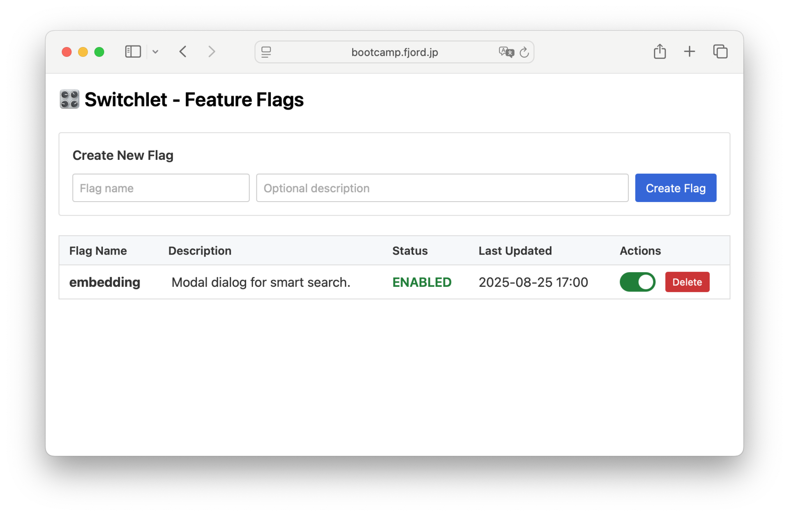

# 🎛️ Switchlet

Minimal feature flag gem. Simple boolean feature flags stored in database with web admin interface.

## Installation

Add to your Gemfile:

```ruby
gem 'switchlet'
```

Then execute:

```bash
bundle install
rails generate switchlet:install
rails db:migrate
```

## Usage

```ruby
# Check if feature is enabled (returns false for unregistered flags)
Switchlet.enabled?(:my_feature)  # => false

# Enable a feature
Switchlet.enable!(:my_feature)   # => true

# Enable a feature with description
Switchlet.enable!(:my_feature)   # => true

# Disable a feature
Switchlet.disable!(:my_feature)  # => false

# Disable with description
Switchlet.disable!(:my_feature)  # => false

# Update description or enabled status
Switchlet.update!(:my_feature, description: "Updated description")  # => Flag object
Switchlet.update!(:my_feature, enabled: false)  # => Flag object
Switchlet.update!(:my_feature, description: "New description", enabled: true)  # => Flag object

# Delete a feature flag
Switchlet.delete!(:my_feature)   # => nil

# List all feature flags (includes descriptions)
Switchlet.list  # => [{ name: "my_feature", enabled: true, description: "New payment system", updated_at: Time }]
```

### Common Usage Patterns

Feature flags are often combined with other conditions for more sophisticated control:

```ruby
# Time-based rollout: Enable feature after specific date
if Switchlet.enabled?(:my_feature) && Time.current >= Time.zone.parse("2025-06-01 00:00:00")
  # New feature implementation
  render :new_checkout_process
else
  # Fallback to old implementation
  render :old_checkout_process
end

# User-based gradual rollout: Enable for specific user segments
if Switchlet.enabled?(:my_feature) && current_user.id % 4 == 0
  # Enable for 25% of users (user IDs divisible by 4)
  show_new_dashboard_ui
else
  show_classic_dashboard_ui
end

# Role-based access: Enable only for specific user roles
if Switchlet.enabled?(:my_feature) && current_user.admin?
  # Admin-only feature
  render_admin_analytics_panel
else
  render_basic_stats
end

# Complex conditions: Combine multiple criteria
if Switchlet.enabled?(:beta_features) && 
   current_user.beta_tester? && 
   Time.current.hour.between?(9, 17)
  # Beta feature available only during business hours for beta testers
  enable_experimental_features
end
```

## Web UI

Switchlet includes a web interface for managing feature flags:



```ruby
# Add to your routes.rb
mount Switchlet::Engine => "/switchlet"
```

Then visit `/switchlet` in your browser to:
- View all feature flags with descriptions
- Toggle flags ON/OFF
- Create new flags with optional descriptions
- Edit descriptions inline (click to edit)
- Delete existing flags

### Securing the Web Interface

**⚠️ Important: The web interface should be secured in production environments.**

#### Custom Authentication (Recommended)

Integrate with your existing authentication system:

```ruby
# config/initializers/switchlet.rb
Switchlet.configure do |config|
  # Devise + admin role
  config.authenticate_with do |controller|
    controller.authenticate_user! && controller.current_user.admin?
  end
end
```

Examples for different authentication systems:

```ruby
# CanCanCan authorization
config.authenticate_with do |controller|
  controller.authorize! :manage, :switchlet
end

# Custom session-based authentication
config.authenticate_with do |controller|
  controller.session[:admin_logged_in] == true
end

# Simple role check
config.authenticate_with do |controller|
  controller.current_user&.role == 'admin'
end
```

#### Basic Authentication

For simple username/password protection:

```ruby
# config/initializers/switchlet.rb
Switchlet.configure do |config|
  config.basic_auth_enabled = Rails.env.production?
  config.basic_auth_username = ENV['SWITCHLET_USERNAME']
  config.basic_auth_password = ENV['SWITCHLET_PASSWORD']
end
```

#### IP Restriction

Restrict access to specific IP addresses:

```ruby
# config/initializers/switchlet.rb
Switchlet.configure do |config|
  config.allowed_ips = [
    '127.0.0.1',          # localhost
    '10.0.0.0/8',         # private network
    '192.168.1.0/24'      # local network
  ]
end
```

#### Multiple Authentication Methods

You can combine multiple methods. The authentication priority is:
1. Custom authentication block (highest priority)
2. IP restriction (if no custom auth)
3. Basic authentication (if configured)

```ruby
Switchlet.configure do |config|
  # Custom auth takes precedence
  config.authenticate_with do |controller|
    controller.current_user&.admin?
  end
  
  # IP restriction works alongside custom auth
  config.allowed_ips = ['10.0.0.0/8']
  
  # Basic auth as fallback (won't be used if custom auth is set)
  config.basic_auth_enabled = true
  config.basic_auth_username = ENV['SWITCHLET_USERNAME']
  config.basic_auth_password = ENV['SWITCHLET_PASSWORD']
end
```

## Rake Tasks

```bash
rake switchlet:list
rake switchlet:enable[feature_name]
rake switchlet:disable[feature_name]
rake switchlet:delete[feature_name]
```

## Notes

- No caching - reads directly from database
- Unregistered flags return `false`
- No YAML/ENV/actor/percentage support
- Requires Rails 6.1 or later

## Development

After checking out the repo, run `bin/setup` to install dependencies. Then, run `rake test` to run the tests. You can also run `bin/console` for an interactive prompt that will allow you to experiment.

To install this gem onto your local machine, run `bundle exec rake install`. To release a new version, update the version number in `version.rb`, and then run `bundle exec rake release`, which will create a git tag for the version, push git commits and the created tag, and push the `.gem` file to [rubygems.org](https://rubygems.org).

## Contributing

Bug reports and pull requests are welcome on GitHub at https://github.com/komagata/switchlet.

## License

The gem is available as open source under the terms of the [MIT License](https://opensource.org/licenses/MIT).
